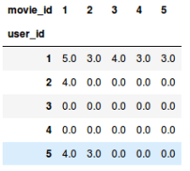

# Problem 17: Building a toy recommendation system

_Version 2.1_

**Pro-tips.** If your program behavior seems strange, try resetting the kernel and rerunning everything. If you mess up this notebook or just want to start from scratch, save copies of all your partial responses and use `Actions` $\rightarrow$ `Reset Assignment` to get a fresh, original copy of this notebook. (_Resetting will wipe out any answers you've written so far, so be sure to stash those somewhere safe if you intend to keep or reuse them!_)

## Introduction

In this problem, we are going to explore the concepts behind Recommendation Systems and see how we can build a toy recommendation system from scratch. From Amazon to Netflix, Google to Goodreads, recommendation engines are one of the most widely used applications of machine learning techniques.  Here, we'll only implement a simple version of the same which will help us see how straightforward analysis on available data can help us build a minimum viable version of a product that is widely used in the industry today.

This problem tests your understanding of computation using basic Python constructs (dicts, list, etc), Numpy and Pandas.


## Problem Statement

In this problem we'll implement a toy recommendation system to recommend movies to users based on their reviews. For this, we use the MovieLens 'small' data set. We will be implementing a collaborative-filtering recommendation system. You need not worry about the details as the exercises will contain enough information and will walk you through the process. To learn more about recommendation systems you may refer to this [wikipedia page](https://en.wikipedia.org/wiki/Recommender_system).

Run the next cells below to import the necessary libraries and to load the data


```python
# Run the below cell to import necessary libraries
import pandas as pd
import numpy as np
from IPython.display import display, Markdown # For pretty-printing tibbles

print("Successfully imported necessary libraries! Let's begin!")
```

    Successfully imported necessary libraries! Let's begin!
    


```python
# Run this cell to read the data from the CSV

ratings_data = pd.read_csv("ratings.csv")

print(f"Ratings data is now available in as a pandas dataframe. Here's a sample of what it looks like: ")
display(ratings_data.head(5))
```

    Ratings data is now available in as a pandas dataframe. Here's a sample of what it looks like: 
    


<div>
<style scoped>
    .dataframe tbody tr th:only-of-type {
        vertical-align: middle;
    }

    .dataframe tbody tr th {
        vertical-align: top;
    }

    .dataframe thead th {
        text-align: right;
    }
</style>
<table border="1" class="dataframe">
  <thead>
    <tr style="text-align: right;">
      <th></th>
      <th>userId</th>
      <th>movieId</th>
      <th>rating</th>
      <th>timestamp</th>
    </tr>
  </thead>
  <tbody>
    <tr>
      <th>0</th>
      <td>1</td>
      <td>1</td>
      <td>4.0</td>
      <td>964982703</td>
    </tr>
    <tr>
      <th>1</th>
      <td>1</td>
      <td>3</td>
      <td>4.0</td>
      <td>964981247</td>
    </tr>
    <tr>
      <th>2</th>
      <td>1</td>
      <td>6</td>
      <td>4.0</td>
      <td>964982224</td>
    </tr>
    <tr>
      <th>3</th>
      <td>1</td>
      <td>47</td>
      <td>5.0</td>
      <td>964983815</td>
    </tr>
    <tr>
      <th>4</th>
      <td>1</td>
      <td>50</td>
      <td>5.0</td>
      <td>964982931</td>
    </tr>
  </tbody>
</table>
</div>


```python
# A temporary dataset to help with testcases and debugging

temp = pd.DataFrame(columns = ['userId','movieId','rating','timestamp'])
temp.loc[len(temp)] = [22,4,3.0,123]
temp.loc[len(temp)] = [22,5,3.0,123]
temp.loc[len(temp)] = [22,6,3.0,123]
temp.loc[len(temp)] = [142,2,3.0,123]
temp.loc[len(temp)] = [142,3,3.0,123]
temp.loc[len(temp)] = [142,4,3.0,123]
temp.loc[len(temp)] = [31,2,3.0,123]
temp.loc[len(temp)] = [31,3,3.0,123]
temp.loc[len(temp)] = [31,5,3.0,123]
temp.loc[len(temp)] = [23,1,3.0,123]
temp.loc[len(temp)] = [23,2,3.0,123]
temp.loc[len(temp)] = [23,3,3.0,123]
temp.loc[len(temp)] = [25,4,3.0,123]
temp.loc[len(temp)] = [25,5,3.0,123]
temp.loc[len(temp)] = [25,6,3.0,123]

random_dataframe = ratings_data.sample(1000, random_state=10)

print("A temporary dataset built to help with visible testcases and debugging: ")
display(temp.head(5))
```

    A temporary dataset built to help with visible testcases and debugging: 
    


<div>
<style scoped>
    .dataframe tbody tr th:only-of-type {
        vertical-align: middle;
    }

    .dataframe tbody tr th {
        vertical-align: top;
    }

    .dataframe thead th {
        text-align: right;
    }
</style>
<table border="1" class="dataframe">
  <thead>
    <tr style="text-align: right;">
      <th></th>
      <th>userId</th>
      <th>movieId</th>
      <th>rating</th>
      <th>timestamp</th>
    </tr>
  </thead>
  <tbody>
    <tr>
      <th>0</th>
      <td>22.0</td>
      <td>4.0</td>
      <td>3.0</td>
      <td>123.0</td>
    </tr>
    <tr>
      <th>1</th>
      <td>22.0</td>
      <td>5.0</td>
      <td>3.0</td>
      <td>123.0</td>
    </tr>
    <tr>
      <th>2</th>
      <td>22.0</td>
      <td>6.0</td>
      <td>3.0</td>
      <td>123.0</td>
    </tr>
    <tr>
      <th>3</th>
      <td>142.0</td>
      <td>2.0</td>
      <td>3.0</td>
      <td>123.0</td>
    </tr>
    <tr>
      <th>4</th>
      <td>142.0</td>
      <td>3.0</td>
      <td>3.0</td>
      <td>123.0</td>
    </tr>
  </tbody>
</table>
</div>


## Data Transformation

### Exercise 0 (1 point "exposed"; 2 points hidden)

The first step in the process will be to build a representation of user preferences for the items. In our case, users are movie viewers and items are the movies themselves.  

The data file 'ratings.csv ' contains data in the format (userId, movieId, rating, timestamp). Our objective now is to represent this data in the form of a preference matrix where each row represents a userId's ratings for different movies. (Below is an example) 



Additionally, we will also compute the following: 
1. **user_id_index**: a map that stores user ids as keys and their corresponding row index in the ratings matrix as values.

2. **index_movie_id**: a map that stores the column index of movie ids as keys and movie ids as the values. 


Please note the following: 
> 
1. Dimensions of the matrix should be ```(number of userIds) x (number of movieIds)```. 
2. All missing values should be replaced with 0. (In case a user hasn't rated a movie) 
3. The ```movieId```s in columns should be sorted based on their numerical value. 


Complete the ```buildMatrix()``` function below. ```buildMatrix``` takes as input one parameter - the dataframe representing the ratings data and returns the following as a 3-tuple:
1. a 2-D numpy array 'ratings' representing the preference matrix as described above.
2. a dict 'user_id_index' as described above
3. a dict 'index_movie_id' as described above

> Hint: You may refer to [pandas pivot function](https://pandas.pydata.org/pandas-docs/stable/reference/api/pandas.DataFrame.pivot.html) which should help you build the preference matrix with ease!


```python
def buildMatrix(df):
    ratings = df.pivot(index = 'userId', columns ='movieId', values = 'rating').fillna(0)
    user_id_index = {int(user_id):i for i,user_id in enumerate(sorted(df.userId.unique())) }
    index_movie_id = {i:int(movie_id) for i,movie_id in enumerate(sorted(df.movieId.unique())) }
    return np.array(ratings),user_id_index, index_movie_id

```


```python
# Test cell: `build_matrix_test_basic`

### Basic tests using the temp dataframe

actual_pref_matrix_temp, actual_user_id_index_temp, actual_index_movie_id_temp  = buildMatrix(temp)

expected_pref_matrix_temp = np.array([
    [0., 0., 0., 3., 3., 3.],
    [3., 3., 3., 0., 0., 0.],
    [0., 0., 0., 3., 3., 3.],
    [0., 3., 3., 0., 3., 0.],
    [0., 3., 3., 3., 0., 0.]])

expected_user_id_index_temp = {22: 0, 23: 1, 25: 2, 31: 3, 142: 4}

expected_index_movie_id_temp = {0: 1, 1: 2, 2: 3, 3: 4, 4: 5, 5: 6}

assert actual_pref_matrix_temp.shape == expected_pref_matrix_temp.shape, \
                                        f"The preference matrix you returned has the incorrect shape: \
                                        {actual_pref_matrix_temp.shape}; Expected shape of preference matrix: \
                                        {expected_pref_matrix_temp.shape}"
assert np.all(np.equal(actual_pref_matrix_temp, expected_pref_matrix_temp)), \
                                        f"Please check your steps in computing the preference matrix"

assert actual_user_id_index_temp == expected_user_id_index_temp, \
                            f"The user_id_index generated does not match with what is expected. Expected: {expected_user_id_index_temp}"

assert actual_index_movie_id_temp == expected_index_movie_id_temp, \
                            f"The index_movie_id generated does not match with what is expected. Expected: {expected_index_movie_id_temp}"

print("Passed!")

```

    Passed!
    


```python
# Test cell: `build_matrix_test_hidden`

print("""
This test cell will be replaced with one hidden test case.
You will only know the result after submitting to the autograder.
If the autograder times out, then either your solution is highly
inefficient or contains a bug (e.g., an infinite loop).
""")

###
### AUTOGRADER TEST - DO NOT REMOVE
###

```

    
    This test cell will be replaced with one hidden test case.
    You will only know the result after submitting to the autograder.
    If the autograder times out, then either your solution is highly
    inefficient or contains a bug (e.g., an infinite loop).
    
    

## How do we know what to recommend? 

We now have a representation of the data in a format that should be easy to work with. Let's move ahead and think about a way in which we can mathematically represent similarity between two users or two movies. Similarity can be measured in various ways. One such similarity measure is the Cosine similarity. 

In this problem, we will use cosine similarity (explained below) as our measure of similarity:

>Cosine Similarity is defined as the cosine of the angle between two vectors. It gives a measure of how similar the given vectors are. It is defined as follows:

$$Similarity = cos(\theta) = \frac{A.B}{\|A\| \|B\|} = = \frac{\sum_{i=1}^{n} A_i B_i}{\sqrt{\sum_{i=1}^{n} A_i^{2}}     \sqrt{\sum_{i=1}^{n} B_i^{2}}}$$


You can read more about Cosine similarity [here](https://en.wikipedia.org/wiki/Cosine_similarity). 

### Exercise 1 (1 point "exposed"; 1 point hidden)

Now let's implement a function to compute the cosine similarity. Complete the code for the following function, ```cosine```, to compute the Cosine Similarity between two  given vectors ```vA```,```vB```. 


```python
def cosine(vA,vB):
    ### BEGIN SOLUTION
    return np.dot(vA, vB) / (np.sqrt(np.dot(vA,vA)) * np.sqrt(np.dot(vB,vB)))

    ### Alternate solution
    return np.dot(vA, vB) / (np.linalg.norm(vA) * np.linalg.norm(vB))
    ### END SOLUTION
```


```python
# Test cell: `cosine_similarity_test_basic`

print("Checking basic test cases...")

print("Testing against equal vectors...")
x = np.arange(1000)
y = np.arange(1000)
epsilon = 1e-6
assert abs(cosine(x,y) - 1) < epsilon, "Please check your implementation - two vectors that are equal should have a cosine similarity of 1"

print("Testing against orthogonal vectors...")
xx = np.array([1, 0, 100, 0])
yy = np.array([0, 1, 0, 1])
assert abs(cosine(xx,yy)) < epsilon, "Please check your implementation - two vectors that are orthogonal should have a cosine similarity of 0"

print("Passed!\n")
```

    Checking basic test cases...
    Testing against equal vectors...
    Testing against orthogonal vectors...
    Passed!
    
    


```python
# Test cell: `cosine_similarity_test_hidden`

print("""
This test cell will be replaced with one hidden test case.
You will only know the result after submitting to the autograder.
If the autograder times out, then either your solution is highly
inefficient or contains a bug (e.g., an infinite loop).
""")

###
### AUTOGRADER TEST - DO NOT REMOVE
###

```

    
    This test cell will be replaced with one hidden test case.
    You will only know the result after submitting to the autograder.
    If the autograder times out, then either your solution is highly
    inefficient or contains a bug (e.g., an infinite loop).
    
    

## User - User Collaborative Recommendation System 

Collborative Recommendation systems work by first finding similar users(or items) and then uses the preferences of the similar users to make recommendations.

A User-User Collaborative Recommendation System works as follows:

For a given user, we find a group of similar users based on our similarity metric. Once we have a group of similar users, we recommend those items which the group of similar users have liked but the actual user hasn't seen/liked yet. 


## Exercise 2

We will now implement the logic to select top 10 users from all the users. Implement the method ```select_users``` to select top 10 similar users and return their ```userId```. The method ```select_users``` takes as parameters the following:
1. ```ratings```: the numpy matrix we get from the previously defined ```buildMatrix``` method
2. ```user_id_index```: a map that stores user ids as keys and their corresponding row index in the ratings matrix as values.
3. ```current_user_id```: the user id for which we need to find similar users. 

The expected return values is the list of user ids corresponding to the top 10 users with the highest cosine similarity match of their ratings profile, sorted in descending order (if there is a tie in cosine scores, sort in ascending order of user id). 

> Note: 
1. The ratings profile of a user is simply the row corresponding to the user in the ratings matrix.
2. Remember to return a python list


```python
def select_users(ratings,user_id_index,current_user_id):
    ### BEGIN SOLUTION
    similarity = []
    current_user_profile = ratings[user_id_index[current_user_id]]

    for u_id in user_id_index.keys():
        if current_user_id != u_id:
            u_id_profile = ratings[user_id_index[u_id]]
            similarity.append((u_id,cosine(u_id_profile,current_user_profile)))
            
    similarity.sort(key = lambda x: x[1],reverse = True)
    return [x[0] for x in similarity[0:10]]
    ### END SOLUTION
```


```python
actual_pref_matrix, actual_user_id_index, actual_index_movie_id  = buildMatrix(random_dataframe)
select_users(actual_pref_matrix, actual_user_id_index, 345)

```


    [1, 3, 4, 6, 7, 9, 14, 15, 16, 18]


```python
# Test cell: `select_users_test_basic`

print("Checking against basic test cases for select_users...")

actual_pref_matrix_temp, actual_user_id_index_temp, actual_index_movie_id_temp  = buildMatrix(temp)
expected_similar_users_temp = np.array([25, 31, 142, 23])
actual_similar_users_temp = select_users(actual_pref_matrix_temp, actual_user_id_index_temp, 22)

assert np.all(np.equal(expected_similar_users_temp, actual_similar_users_temp)), "The expected list of similar users does not match with \
                                                        the actual returned list of similar users. \
                                                        Expected: {expected_similar_users_temp};  \
                                                        Actual: {actual_similar_users_temp}"

print("Passed!\n")
```

    Checking against basic test cases for select_users...
    Passed!
    
    


```python
# Test cell: `select_users_test_hidden`

print("""
This test cell will be replaced with one hidden test case.
You will only know the result after submitting to the autograder.
If the autograder times out, then either your solution is highly
inefficient or contains a bug (e.g., an infinite loop).
""")

###
### AUTOGRADER TEST - DO NOT REMOVE
###

```

    
    This test cell will be replaced with one hidden test case.
    You will only know the result after submitting to the autograder.
    If the autograder times out, then either your solution is highly
    inefficient or contains a bug (e.g., an infinite loop).
    
    

## Exercise 3

Our implementation is almost complete.  

All that's left to do now is to return recommendations by fetching them based on the preferences of users selected through our ```select_users method```. 

Implement the method ```recommend_user_user``` to find one movie each from each of the top 10 users returned by above method.

Your task is simple. For each of the top 10 similar users, recommend the first movie (in order of their column position in ratings matrix). Ignore duplicates and the order is not important. 

The function ```recommend_user_user``` takes in the following parameters:
1. ```ratings```: the preference matrix returned from the ```build_matrix``` function
2. ```similar_user_ids```: the list of similar user_ids returned from the ```select_users_method```
3. ```user_id_index```: user_id_index returned from the ```build_matrix``` function
4. ```index_movie_id``` index_movie_id returned from the ```build_matrix``` function

The expected output from ```recommend_user_user``` is a set of movies as described. 


```python
def recommend_user_user(ratings, similar_user_ids, user_id_index, index_movie_id):
    ### BEGIN SOLUTION
    recommendations = set()
    for similar_user_id in similar_user_ids:
        similar_user_profile = ratings[user_id_index[similar_user_id]]
        # print(similar_user_profile)
        for indx,movie_rating in enumerate(similar_user_profile):
            if movie_rating!=0.0:
                recommendations.add(index_movie_id[indx])
                break 
    return recommendations 
    ### END SOLUTION
```


```python
# Test cell: `recommend_user_test_basic`

print("Checking basic test cases...")

actual_pref_matrix_temp, actual_user_id_index_temp, actual_index_movie_id_temp  = buildMatrix(temp)
actual_similar_users_temp = select_users(actual_pref_matrix_temp, actual_user_id_index_temp, 22)

expected_recommendations_temp = set([1,2,4])
actual_recommendations_temp = recommend_user_user(actual_pref_matrix_temp, actual_similar_users_temp, actual_user_id_index_temp, actual_index_movie_id_temp)

assert expected_recommendations_temp == actual_recommendations_temp, "Expected recommendations were {expected_recommendations_temp}; \
                                        but actual recommendations recieved were: {actual_recommendations_temp}"

print("Passed!\n")
```

    Checking basic test cases...
    Passed!
    
    


```python
# Test cell: `recommend_user_test_hidden`

print("""
This test cell will be replaced with one hidden test case.
You will only know the result after submitting to the autograder.
If the autograder times out, then either your solution is highly
inefficient or contains a bug (e.g., an infinite loop).
""")

###
### AUTOGRADER TEST - DO NOT REMOVE
###

```

    
    This test cell will be replaced with one hidden test case.
    You will only know the result after submitting to the autograder.
    If the autograder times out, then either your solution is highly
    inefficient or contains a bug (e.g., an infinite loop).
    
    

**Fin!** You’ve reached the end of this part. Don’t forget to restart and run all cells again to make sure it’s all working when run in sequence; and make sure your work passes the submission process. Good luck!
