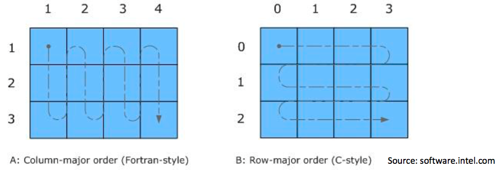

# Part 2: Dense matrix storage 
This part of the lab is a brief introduction to efficient storage of matrices.

**Exercise 0** (ungraded). Import Numpy!


```python
import sys
print(sys.version)

import numpy as np
print(np.__version__)
```

    3.7.4 (tags/v3.7.4:e09359112e, Jul  8 2019, 20:34:20) [MSC v.1916 64 bit (AMD64)]
    1.18.1
    

## Dense matrix storage: Column-major versus row-major layouts

For linear algebra, we will be especially interested in 2-D arrays, which we will use to store matrices. For this common case, there is a subtle performance issue related to how matrices are stored in memory.

By way of background, physical storage---whether it be memory or disk---is basically one big array. And because of how physical storage is implemented, it turns out that it is much faster to access consecutive elements in memory than, say, to jump around randomly.

A matrix is a two-dimensional object. Thus, when it is stored in memory, it must be mapped in some way to the one-dimensional physical array. There are many possible mappings, but the two most common conventions are known as the _column-major_ and _row-major_ layouts:



**Exercise 1** (2 points). Let $A$ be an $m \times n$ matrix stored in column-major format. Let $B$ be an $m \times n$ matrix stored in row-major format.

Based on the preceding discussion, recall that these objects will be mapped to 1-D arrays of length $mn$, behind the scenes. Let's call the 1-D array representations $\hat{A}$ and $\hat{B}$. Thus, the $(i, j)$ element of $a$, $a_{ij}$, will map to some element $\hat{a}_u$ of $\hat{A}$; similarly, $b_{ij}$ will map to some element $\hat{b}_v$ of $\hat{B}$.

Determine formulae to compute the 1-D index values, $u$ and $v$, in terms of $\{i, j, m, n\}$. Assume that all indices are 0-based, i.e., $0 \leq i \leq m-1$, $0 \leq j \leq n-1$, and $0 \leq u, v \leq mn-1$.


```python
def linearize_colmajor(i, j, m, n): # calculate `u`
    """
    Returns the linear index for the `(i, j)` entry of
    an `m`-by-`n` matrix stored in column-major order.
    """
    return j * m + i

```


```python
def linearize_rowmajor(i, j, m, n): # calculate `v`
    """
    Returns the linear index for the `(i, j)` entry of
    an `m`-by-`n` matrix stored in row-major order.
    """
    return i * n + j

```


```python
# Test cell: `calc_uv_test`

# Quick check (not exhaustive):
assert linearize_colmajor(7, 4, 10, 20) == 47
assert linearize_rowmajor(7, 4, 10, 20) == 144

assert linearize_colmajor(10, 8, 86, 26) == 698
assert linearize_rowmajor(10, 8, 86, 26) == 268

assert linearize_colmajor(8, 34, 17, 40) == 586
assert linearize_rowmajor(8, 34, 17, 40) == 354

assert linearize_colmajor(32, 48, 37, 55) == 1808
assert linearize_rowmajor(32, 48, 37, 55) == 1808

assert linearize_colmajor(24, 33, 57, 87) == 1905
assert linearize_rowmajor(24, 33, 57, 87) == 2121

assert linearize_colmajor(10, 3, 19, 74) == 67
assert linearize_rowmajor(10, 3, 19, 74) == 743

print ("(Passed.)")
```

    (Passed.)
    

## Requesting a layout in Numpy

In Numpy, you can ask for either layout. The default in Numpy is row-major.

Historically numerical linear algebra libraries were developed assuming column-major layout. This layout happens to be the default when you declare a 2-D array in the Fortran programming language. By contrast, in the C and C++ programming languages, the default convention for a 2-D array is row-major layout. So the Numpy default is the C/C++ convention.

In your programs, you can request either order of Numpy using the `order` parameter. For linear algebra operations (common), we recommend using the column-major convention.

In either case, here is how you would create column- and row-major matrices.


```python
n = 5000
A_colmaj = np.ones((n, n), order='F') # column-major (Fortran convention)
A_rowmaj = np.ones((n, n), order='C') # row-major (C/C++ convention)
```

**Exercise 2** (1 point). Given a matrix $A$, write a function that scales each column, $A(:, j)$ by $j$. Then compare the speed of applying that function to matrices in row and column major order.


```python
def scale_colwise(A):
    """Given a Numpy matrix `A`, visits each column `A[:, j]`
    and scales it by `j`."""
    assert type(A) is np.ndarray
    
    n_cols = A.shape[1] # number of columns
    
    for j in range(n_cols):
        A[:, j] *= j
    return A
```


```python
# Test (timing) cell: `scale_colwise_test`

# Measure time to scale a row-major input column-wise
%timeit scale_colwise(A_rowmaj)

# Measure time to scale a column-major input column-wise
%timeit scale_colwise(A_colmaj)
A_rowmaj.shape
```

    314 ms ± 12 ms per loop (mean ± std. dev. of 7 runs, 1 loop each)
    26 ms ± 357 µs per loop (mean ± std. dev. of 7 runs, 10 loops each)
    


    (5000, 5000)


## Python vs. Numpy example: Matrix-vector multiply

Look at the definition of matrix-vector multiplication from [Da Kuang's linear algebra notes](https://www.dropbox.com/s/f410k9fgd7iesdv/kuang-linalg-notes.pdf?dl=0). Let's benchmark a matrix-vector multiply in native Python, and compare that to doing the same operation in Numpy.

First, some setup. (What does this code do?)


```python
# Dimensions; you might shrink this value for debugging
n = 2
```


```python
# Generate random values, for use in populating the matrix and vector
from random import gauss

# Native Python, using lists
A_py = [gauss(0, 1) for i in range(n*n)] # Assume: Column-major
x_py = [gauss(0, 1) for i in range(n)]
```


```python
# Convert values into Numpy arrays in column-major order
A_np = np.reshape(A_py, (n, n), order='F')
x_np = np.reshape(x_py, (n, 1), order='F')
A_np
```


    array([[-0.01031943, -1.23011495],
           [ 0.28429982,  1.58003374]])


```python
# Here is how you do a "matvec" in Numpy:
%timeit A_np.dot(x_np)
```

    657 ns ± 31.5 ns per loop (mean ± std. dev. of 7 runs, 1000000 loops each)
    

**Exercise 3** (3 points). Implement a matrix-vector product that operates on native Python lists. Assume the 1-D **column-major** storage of the matrix.


```python
def matvec_py(m, n, A, x):
    """
    Native Python-based matrix-vector multiply, using lists.
    The dimensions of the matrix A are m-by-n, and x is a
    vector of length n.
    """
    assert type(A) is list and all([type(aij) is float for aij in A])
    assert type(x) is list
    assert len(x) >= n
    assert len(A) >= (m*n)

    y = [0.] * m
    
    for i in range(m):
        for j, k in enumerate(A[i::m]):
            y[i] += k * x[j]
    
    return y
```


```python
# Test cell: `matvec_py_test`

# Estimate a bound on the difference between these two
EPS = np.finfo (float).eps # "machine epsilon"
CONST = 10.0 # Some constant for the error bound
dy_max = CONST * n * EPS

print ("""==> Error bound estimate:
         C*n*eps
         == %g*%g*%g
         == %g
""" % (CONST, n, EPS, dy_max))

# Run the Numpy version and your code
y_np = A_np.dot (x_np)
y_py = matvec_py (n, n, A_py, x_py)

# Compute the difference between these
dy = y_np - np.reshape (y_py, (n, 1), order='F')
dy_norm = np.linalg.norm (dy, ord=np.inf)

# Summarize the results
from IPython.display import display, Math

comparison = "\leq" if dy_norm <= dy_max else "\gt"
display (Math (
        r'||y_{\textrm{np}} - y_{\textrm{py}}||_{\infty}'
        r' = \textrm{%g} %s \textrm{%g}\ (\textrm{estimated bound})'
        % (dy_norm, comparison, dy_max)
    ))

if n <= 4: # Debug: Print all data for small inputs
    print ("@A_np:\n", A_np)
    print ("@x_np:\n", x_np)
    print ("@y_np:\n", y_np)
    print ("@A_py:\n", A_py)
    print ("@x_py:\n", x_py)
    print ("@y_py:\n", y_py)
    print ("@dy:\n", dy)

# Trigger an error on likely failure
assert dy_norm <= dy_max
print("\n(Passed!)")
```

    ==> Error bound estimate:
             C*n*eps
             == 10*2*2.22045e-16
             == 4.44089e-15
    
    


$\displaystyle ||y_{\textrm{np}} - y_{\textrm{py}}||_{\infty} = \textrm{0} \leq \textrm{4.44089e-15}\ (\textrm{estimated bound})$


    @A_np:
     [[-0.01031943 -1.23011495]
     [ 0.28429982  1.58003374]]
    @x_np:
     [[-0.92375125]
     [-1.50592202]]
    @y_np:
     [[ 1.86198979]
     [-2.64202992]]
    @A_py:
     [-0.010319430145875127, 0.2842998202225103, -1.2301149535202398, 1.5800337363625319]
    @x_py:
     [-0.9237512469478126, -1.5059220237972335]
    @y_py:
     [1.8619897867734825, -2.6420299153685516]
    @dy:
     [[0.]
     [0.]]
    
    (Passed!)
    


```python
%timeit matvec_py (n, n, A_py, x_py)
```

    6.49 µs ± 1.18 µs per loop (mean ± std. dev. of 7 runs, 100000 loops each)
    

**Fin!** If you've reached this point and everything executed without error, you can submit this part and move on to the next one.
