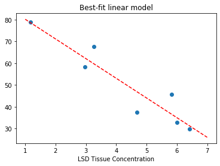

# Part 0: Sample dataset (LSD)

In 1968, Wagner Agahajanian, and Bing conducted a study to determine whether you could improve a student's math test scores using lysergic acid diethylamide, also known as "LSD."

Here is the original data sources. The code cell below downloads the file from an alternative location.
* Raw data: https://www.stat.ufl.edu/~winner/data/lsd.dat
* Data file description: http://www.stat.ufl.edu/~winner/data/lsd.txt


```python
from pandas import read_fwf
from IPython.display import display
from cse6040utils import download_dataset, localize_file

dataset = {'lsd.dat': '4c119057baf86cff8da03d825d7ce141'}
download_dataset(dataset)
print("\n(All data appears to be ready.)")
```

    'lsd.dat' is ready!
    
    (All data appears to be ready.)
    

Let's take a look at the data, first as a table and then using a scatter plot.


```python
df = read_fwf(localize_file('lsd.dat'),
              colspecs=[(0, 4), (7, 13)],
              names=['lsd_concentration', 'exam_score'])
display(df)
```


<div>
<style scoped>
    .dataframe tbody tr th:only-of-type {
        vertical-align: middle;
    }

    .dataframe tbody tr th {
        vertical-align: top;
    }

    .dataframe thead th {
        text-align: right;
    }
</style>
<table border="1" class="dataframe">
  <thead>
    <tr style="text-align: right;">
      <th></th>
      <th>lsd_concentration</th>
      <th>exam_score</th>
    </tr>
  </thead>
  <tbody>
    <tr>
      <th>0</th>
      <td>1.17</td>
      <td>78.93</td>
    </tr>
    <tr>
      <th>1</th>
      <td>2.97</td>
      <td>58.20</td>
    </tr>
    <tr>
      <th>2</th>
      <td>3.26</td>
      <td>67.47</td>
    </tr>
    <tr>
      <th>3</th>
      <td>4.69</td>
      <td>37.47</td>
    </tr>
    <tr>
      <th>4</th>
      <td>5.83</td>
      <td>45.65</td>
    </tr>
    <tr>
      <th>5</th>
      <td>6.00</td>
      <td>32.92</td>
    </tr>
    <tr>
      <th>6</th>
      <td>6.41</td>
      <td>29.97</td>
    </tr>
  </tbody>
</table>
</div>


```python
from matplotlib.pyplot import scatter, xlabel, title, plot
%matplotlib inline

scatter(df['lsd_concentration'], df['exam_score'])
xlabel ('LSD Tissue Concentration')
title ('Shocking news: Math scores degrade with increasing LSD!');
```


## Fitting a model

**Exercise 0** (2 points). Complete the function below so that it computes $\alpha$ and $\beta$ for the univariate model, $y \sim \alpha \cdot x + \beta$, given observations stored as NumPy arrays `y[:]` for the responses and `x[:]` for the predictor.

According to the formulas derived in class (on-campus students) or in the lecture videos (online students), the parameters may be estimated by

$$\begin{eqnarray}
  \alpha & = & \dfrac{x^T y - \frac{1}{m}(u^T x)(u^T y)}
                     {x^T x - \frac{1}{m}(u^T x)^2} \\
   \beta & = & \frac{1}{m} u^T (y - \alpha x)
\end{eqnarray}$$

where $u$ is a vector of all ones.


```python
def linreg_fit(x, y):
    """Returns (alpha, beta) s.t. y ~ alpha*x + beta."""
    from numpy import ones
    
    m = len(x) ; assert len(y) == m
    u = ones(x.shape)
    
    # no need to compute a transpose of u, u.T, since it is all ones
    alpha = (x.T.dot(y) - u.dot(x) * u.dot(y) / m) / (x.T.dot(x) - u.dot(x) ** 2 / m)
    beta = u.dot(y - alpha * x ) / m
    

    #from sklearn.model_selection import train_test_split 
    #from sklearn.linear_model import LinearRegression
    #from sklearn import metrics
    
    #x = x.values.reshape(-1,1)
    #y = y.values.reshape(-1,1)
    
    #x_train, x_test, y_train, y_test = train_test_split(x, y, test_size = 0.2, random_state = 0)
    
    #regressor = LinearRegression()  
    #regressor.fit(x_train, y_train)
    
    #alpha = regressor.coef_[0][0]
    #beta = regressor.intercept_[0]
    
    return (alpha, beta)
    
# Compute the coefficients for the LSD data:
x, y = df['lsd_concentration'], df['exam_score']
alpha, beta = linreg_fit(x, y)

print("alpha:", alpha)
print("beta:", beta)
```

    alpha: -9.0094664152968
    beta: 89.12387376799313
    


```python
# Test cell: `linreg_fit_test`

x, y = df['lsd_concentration'], df['exam_score']
alpha, beta = linreg_fit(x, y)

r = alpha*x + beta - y
ssqr = r.dot(r)
ssqr_ex = 253.88132881

from numpy import isclose
assert isclose(ssqr, ssqr_ex, rtol=.01), \
       f"Sum-of-squared residuals is {ssqr} instead of {ssqr_ex}."

print("\n(Passed!)")
```

    
    (Passed!)
    


```python
from numpy import linspace, floor, ceil

# Two points make a line:
x_fit = linspace(floor(x.min()), ceil(x.max()), 2)
y_fit = alpha*x_fit + beta

scatter(x, y, marker='o')
plot(x_fit, y_fit, 'r--')
xlabel('LSD Tissue Concentration')
title('Best-fit linear model');
```





**Fin!** If you've gotten this far without errors, your notebook is ready to submit.
