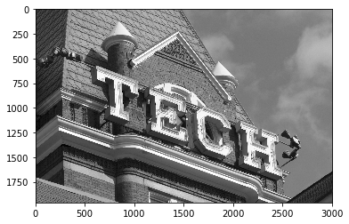
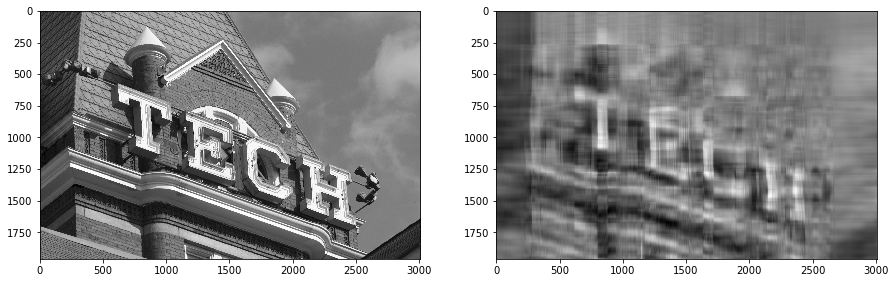
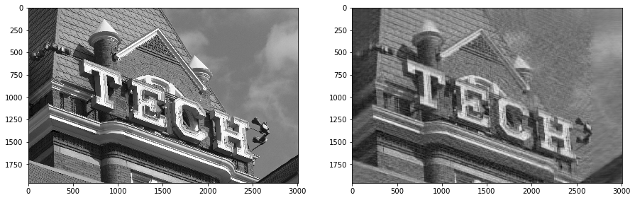

# Problem 1

This problem is about checks that you can apply the singular value decomposition to a "new" problem, namely, the task of compressing an image.

There are six (6) exercises (0-5) worth a total of ten (10) points.

> This final exam problem was later reincorporated into the course as Notebook 15. We've left it in the "sample problems" to give you more examples of the style of problem; if you are looking for new practice problems, you can skip this one.

## Setup

Let's load some modules and an image, which you will use the SVD to compress.


```python
from urllib.request import urlretrieve

import matplotlib.pyplot as plt
%matplotlib inline

import numpy as np
```


```python
from PIL import Image

def load_image_file (fn):
    return Image.open (fn, 'r')

def im2gnp (image):
    """Converts a PIL image into an image stored as a 2-D Numpy array in grayscale."""
    return np.array (image.convert ('L'))

def gnp2im (image_np):
    """Converts an image stored as a 2-D grayscale Numpy array into a PIL image."""
    return Image.fromarray (image_np.astype (np.uint8), mode='L')

def imshow_gray (im, ax=None):
    from matplotlib.pyplot import figure, axes, get_cmap
    if ax is None:
        f = figure ()
        ax = axes ()
    ax.imshow (im,
               interpolation='nearest',
               cmap=get_cmap ('gray'))
```

Let's download an image and represent it by a Numpy matrix, `img`.


```python
urlretrieve ('http://cse6040.gatech.edu/datasets/Tech_Tower_1.jpg', 'tt1.jpg')
pic_raw = load_image_file ('tt1.jpg')
```

Next, let's convert this image to grayscale and print some stats, e.g., its dimensions and size (in pixels).


```python
pic = im2gnp (pic_raw)
imshow_gray (pic)
```





**Exercise 0** (1 point). Write a function that, given a Numpy array-representation of a (grayscale) image, returns its size in pixels.


```python
def sizeof_image (I):
    assert type (I) is np.ndarray
    assert len (I.shape) == 2
    return I.shape[0] * I.shape[1]
```


```python
pic_pixels = sizeof_image (pic)

print ("The image uses about {:.1f} megapixels.".format (1e-6 * pic_pixels))

assert pic_pixels == 5895680
print ("\n(Passed!)")
```

    The image uses about 5.9 megapixels.
    
    (Passed!)
    

## Compression via the truncated SVD

Recall that the $k$-truncated SVD gives the best rank-$k$ approximation to a matrix $A$. That is, if the SVD of $A$ is $A = U \Sigma V^T$, then we can approximate $A$ by

$$
  A \approx U_k \Sigma_k V_k^T,
$$

where $(U_k, \Sigma_k, V_k^T)$ is the $k$-truncated SVD, taken by retaining the $k$ largest singular values (entries of diagonal matrix $\Sigma$), as well as the first $k$ columns of the left and right singular vectors ($U$ and $V$).

Thus, if $A$ is the image then $(U_k, \Sigma_k, V_k^T)$ is a compressed representation of that image.

**Exercise 1** (2 point). Write a function, `compress_image(I, k)`, that compresses an input image `I` by interpreting `I` as a matrix, computing the `k`-truncated SVD, and returning a compressed representation.

For this function, we want you to return a tuple, `(S, Uk, VkT)`, where `S` is an array of _all_ the singular values (not just the top $k$) and `Uk` and `VkT` are the $k$-_truncated_ singular vectors.


```python
def compress_image (I, k):
    from scipy.linalg import svd
    Uk, Sigma, VkT = svd(I)
    return (Sigma, Uk[:,:k], VkT[:k,:])

# Runs your function:
k = 10
Sigma, Uk, VkT = compress_image (pic, k)

print (Sigma.shape)
print (Uk.shape)
print (VkT.shape)
```

    (1960,)
    (1960, 10)
    (10, 3008)
    


```python
assert Sigma.shape == (min (pic.shape),)
assert Uk.shape == (pic.shape[0], k)
assert VkT.shape == (k, pic.shape[1])
assert (Sigma[k:]**2).sum () <= 7e9

print ("\n(Passed!)")
```

    
    (Passed!)
    

**Exercise 2** (1 point). Write a function, `sizeof_compressed_image()`, that returns the number of "equivalent pixels" used by the compressed (truncated SVD) representation.

What are "equivalent pixels?" Recall these facts:

- In the original grayscale image, only 1 byte is needed to store each pixel.
- In the (truncated) SVD representation, each matrix entry is a double-precision value, which requires 8 bytes.

In your implementation of this function, you may count just the $k$ largest singular values even though `compress_image` returns _all_ of the singular values.


```python
def sizeof_compressed_image (Sigma, Uk, VkT):
    m, k = Uk.shape
    k2, n = VkT.shape
    assert k == k2
    return 8 * k * (m + 1 + n)
```


```python
cmp_pixels = sizeof_compressed_image (Sigma, Uk, VkT)

print ("Original image required ~ {:.1f} megapixels.".format (1e-6 * pic_pixels))
print ("Compressed representation retaining k={} singular values is ~ {:.1f} megapixels.".format (k, 1e-6 * cmp_pixels))
print ("The compression ratio is {:.1f}x.".format (pic_pixels / cmp_pixels))

assert cmp_pixels == 397520
print ("\n(Passed!)")
```

    Original image required ~ 5.9 megapixels.
    Compressed representation retaining k=10 singular values is ~ 0.4 megapixels.
    The compression ratio is 14.8x.
    
    (Passed!)
    

**Exercise 3** (2 points). Recall that the error of the compressed representation, as measured in the squared Frobenius norm, is given by the sum of the trailing singular values,

$$
  \|A - U_k \Sigma_k V_k^T\|_F^2 = \sigma_{k}^2 + \sigma_{k+1}^2 + \cdots + \sigma_{s-1}^2,
$$

where $s = \min(m, n)$ if $A$ is $m \times n$ and we assume that the singular values are sorted from largest ($\sigma_0$) to smallest ($\sigma_{s-1}$).

Write a function that returns the _relative_ error, measured using the Frobenius norm, i.e.,

$$
  \dfrac{\|A - U_k \Sigma_k V_k^T\|_F}
        {\|A\|_F}
        .
$$

> The first formula above is $\|\cdot\|_F^2$, whereas the relative error we want you to return is in terms of $\|\cdot\|_F$ (not squared).


```python
def compression_error (Sigma, k):
    """
    Given the singular values of a matrix, return the
    relative reconstruction error.
    """
    S_sqrd = Sigma ** 2
    S_sqrd_l = S_sqrd[:k].sum()
    S_sqrd_r = S_sqrd[k:].sum()
    return (S_sqrd_r / (S_sqrd_r + S_sqrd_l)) ** 0.5
```


```python
err = compression_error (Sigma, k)
print ("Relative reconstruction (compression) error is ~ {:.1f}%.".format (1e2*err))
assert err >= 0.25
print ("\n(Passed!)")
```

    Relative reconstruction (compression) error is ~ 25.1%.
    
    (Passed!)
    

> **Exercise 4** (2 points). Write a function that, given the compressed representation of an image, reconstructs it approximately.


```python
def uncompress_image (Sigma, Uk, VkT):
    m, k = Uk.shape
    k2, n = VkT.shape
    assert k == k2
    return (Uk * Sigma[:k]).dot(VkT)
```


```python
pic_lossy = uncompress_image (Sigma, Uk, VkT)

f, ax = plt.subplots (1, 2, figsize=(15, 30))
imshow_gray (pic, ax[0])
imshow_gray (pic_lossy, ax[1])

abs_err = np.linalg.norm (pic - pic_lossy, ord='fro')
rel_err = abs_err / np.linalg.norm (pic, ord='fro')
print ("Measured relative error is ~ {:.1f}%.".format (1e2 * rel_err))

pred_rel_err = compression_error (Sigma, k)
assert 0.95*pred_rel_err <= rel_err <= 1.05*pred_rel_err
print ("\n(Passed!)")
```

    Measured relative error is ~ 25.1%.
    
    (Passed!)
    





**Exercise 5** (2 points). Write a function that, given the singular values of an image, determines the truncation point, $k$, that would reduce the relative error below a desired threshold.

> _Hint:_ You may find Numpy's [cumulative sum](https://docs.scipy.org/doc/numpy/reference/generated/numpy.cumsum.html) handy.


```python
def find_rank (rel_err_target, Sigma):
    S_sqrd = Sigma ** 2
    abs_err_sq = np.cumsum (S_sqrd[::-1])[::-1]
    rel_err_sq = abs_err_sq / abs_err_sq[0]
    rel_err = np.sqrt (rel_err_sq)
    return np.min (np.where (rel_err < rel_err_target))
```


```python
rel_err_target = 0.15
k_target = find_rank (rel_err_target, Sigma)

print ("Relative error target:", rel_err_target)
print ("Suggested value of k:", k_target)

print ("Compressing...")
Sigma_target, Uk_target, VkT_target \
    = compress_image (pic, k_target)
target_pixels = sizeof_compressed_image (Sigma_target,
                                         Uk_target,
                                         VkT_target)
target_ratio = pic_pixels / target_pixels
print ("Estimated compression ratio: {:.1f}x".format (target_ratio))

pic_target = uncompress_image (Sigma_target, Uk_target, VkT_target)
f, ax = plt.subplots (1, 2, figsize=(15, 30))
imshow_gray (pic, ax[0])
imshow_gray (pic_target, ax[1])

assert compression_error (Sigma, k_target) <= rel_err_target
assert compression_error (Sigma, k_target-1) > rel_err_target

print ("\n(Passed!)")
```

    Relative error target: 0.15
    Suggested value of k: 47
    Compressing...
    Estimated compression ratio: 3.2x
    
    (Passed!)
    





**Fin!** If you've reached this point and all tests above pass, you are ready to submit your solution to this problem. Don't forget to save you work prior to submitting.
